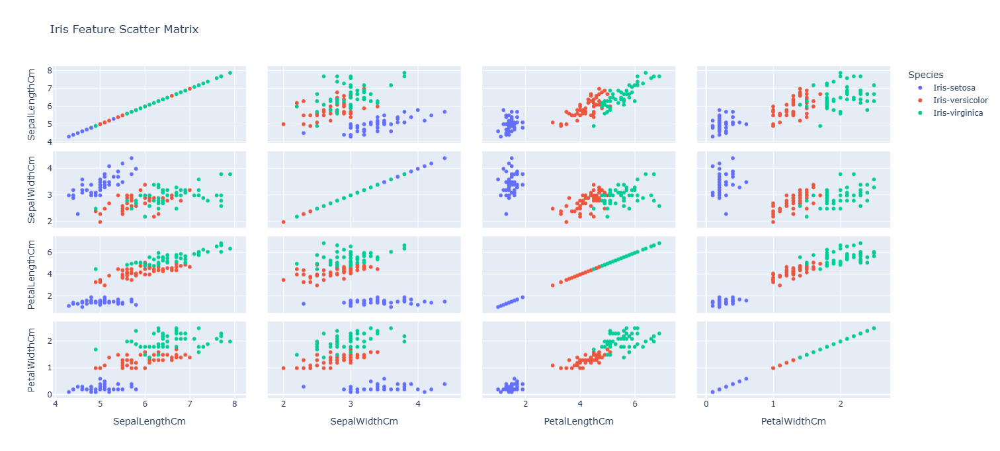
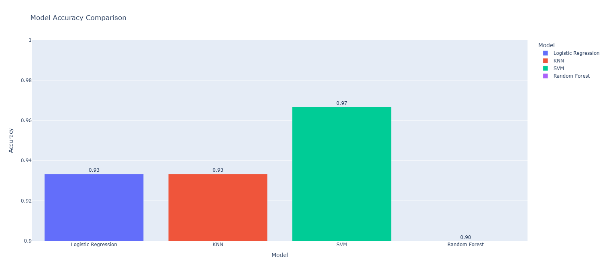
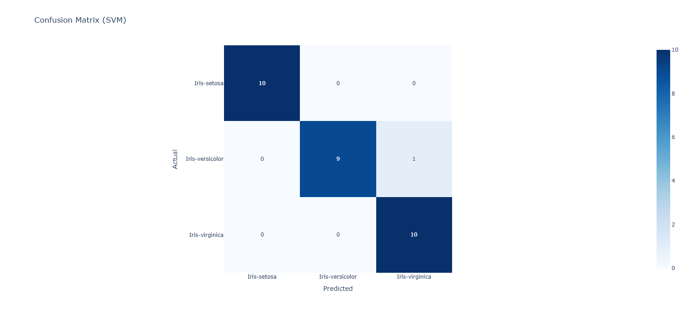
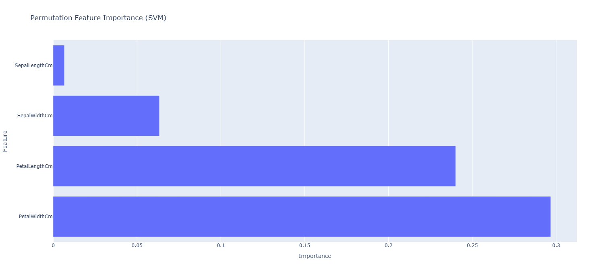

# 🌸 Iris Flower Classification Using Machine Learning

## 📌 Overview
This project focuses on classifying Iris flowers into three species using machine learning algorithms.  
The classic Iris dataset is used to demonstrate an end-to-end multi-class classification workflow including data exploration, model training, evaluation, and comparison.

---

## 🎯 Objective
- Classify Iris flowers into:
  - Iris-setosa
  - Iris-versicolor
  - Iris-virginica
- Train and compare multiple ML classification models
- Evaluate model performance using accuracy and confusion matrix

---

## 📊 Dataset
- Source: Built-in Iris dataset from `scikit-learn`
- Total samples: 150
- Features:
  - Sepal Length
  - Sepal Width
  - Petal Length
  - Petal Width
- Target:
  - Species (3 classes)

---

## 🧠 Models Used
- Logistic Regression
- K-Nearest Neighbors (KNN)
- Support Vector Machine (SVM)
- Random Forest Classifier

---

## 🔬 Methodology
1. Load dataset using `sklearn.datasets`
2. Perform exploratory data analysis (EDA)
3. Split data into training and testing sets
4. Apply feature scaling
5. Train multiple classification models
6. Compare models based on accuracy
7. Evaluate best model using confusion matrix and classification report

---

## 📈 Evaluation Metrics
- Accuracy
- Confusion Matrix
- Classification Report

---

## 📓 Notebook
The complete implementation is available in:
## 📊 Visualizations

### 🌸 Scatter Matrix (Feature Relationships)
  
🔗 [Interactive Plot](scatter_matrix.html)

---

### 📈 Model Accuracy Comparison
  
🔗 [Interactive Plot](model_accuracy.html)

---

### 🔍 Confusion Matrix
  
🔗 [Interactive Plot](confusion_matrix.html)

---

### 🧠 Permutation Feature Importance
  
🔗 [Interactive Plot](permutation_feature_importance.html)

---

## 🚀 How to Run
```bash
pip install -r requirements.txt
iris_classification.ipynb
